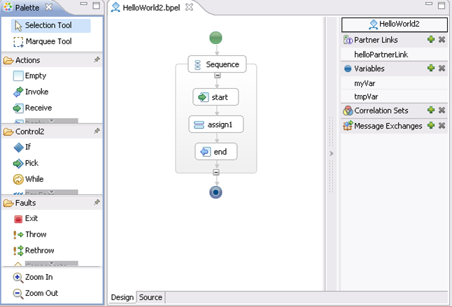

# Демонстрация на BPEL бизнес процес

[BPEL](https://en.wikipedia.org/wiki/Business_Process_Execution_Language)(или Business Process Execution Language) стандартизиран изпълним език за реализиране на бизнес процеси като съвкупност от свързани дейности (и интеграция със SOAP услуги).

## Технологии
- [Eclipse IDE](https://www.eclipse.org/downloads/) - среда за разработка поддържаща разнообразни плъгини.
- [BPEL Designer Eclipse plugin](https://www.eclipse.org/bpel/) - плъгин за визуално моделиране на BPEL.
- [Apache Tomcat](http://tomcat.apache.org/download-80.cgi) - базов Java сървър.
- [Apache ODE](https://ode.apache.org/getting-ode.html) - специализирана среда поддържаща и изпълняваща бизнес процеси (представлява Java приложение инсталирано в Apache Tomcat).
- [soapUI](https://www.soapui.org/downloads/soapui.html) - клиент за SOAP услуги.

---

## Разработка

1. Инсталирайте Eclipse IDE.
1. Инсталирайте BPEL Designer plugin (Help > Install New Software, изберете "All Available Sites" и потърсете "bpel", изберете плъгините; натиснете Next и завършете инсталацията).
1. Импортирайте проекта (File > Import > Projects from Folder or Archive; изберете директорията на проекта).
1. Разгледайте конфигурацията на проекта.

 

## Стартиране

1. Разархивирайте и стартирайте Apache Tomcat: `bin/startup.sh`.
1. Инсталирайте Apache ODE war в Apache Tomcat като го копирате в директория `webapps/`.
1. Верифицирайте, че Apache ODE работи като отворите административната страница на http://localhost:8080/ode/.
1. Инсталирайте примерния процес като копирате директория `helloworld/` в директория `processes/` на ODE (т.е. `webapps/ode/WEB-INF/processes`).
1. Верифицирайте, че процесът е инсталиран успешно като проверите административната страница на Apache ODE.
1. Открийте WSDL-а на услугата в Apache ODE в Process Models > unit:HelloWorld > Endpoints (http://localhost:8080/ode/processes/helloWorld?wsdl).
1. Импортирайте услугата в SOAP UI и пратете няколко заявки. Това ще стартира инстанции от процеса връщащи резултат.
1. Разгледайте инстанциите на процесите в административната страница на Apache ODE.

### Приключване
След приключване на демонстрацията спрете Apache Tomcat: `bin/shutdown.sh`.