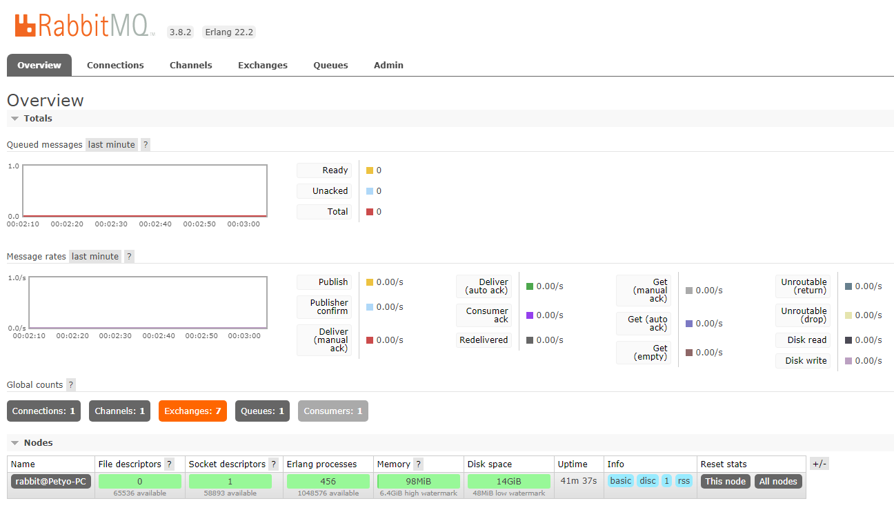

# Демонстрация на Messaging с AMQP (0-9-1)

[AMQP](https://en.wikipedia.org/wiki/Advanced_Message_Queuing_Protocol)(или Advanced Message Queuing Protocol) е протокол за изпращане и получаване на съобщения.

## Технологии
- Препочъва се използването на OpenJDK 8.
- [RabbitMQ](https://www.rabbitmq.com/) - AMQP message-oriented middleware.
  - Примери: https://www.rabbitmq.com/getstarted.html, https://github.com/rabbitmq/rabbitmq-tutorials/tree/master/java

## Билд
```
mvnw clean package
```

---

## Стартиране

### Изисквания
За да работи примера трябва да инсталирате и стартирате RabbitMQ брокер. 

#### Инструкции за инсталация
1. Изтеглете и инсталирайте Erlang и OTP (https://www.erlang.org/downloads)
1. Изпълнете и инсталирайте RabbitMQ (https://www.rabbitmq.com/download.html). Брокерът се стартира като сървис.
1. Включете плъгина за администация като идете в директория `<install-dir>/rabbitmq_server-<version>/sbin` и изпълните команда `rabbitmq-plugins enable rabbitmq_management` (https://www.rabbitmq.com/management.html)
1. Отворете административната страница на RabbitMQ http://localhost:15672/ (креденции: guest/guest)



### Консуматор на съобщения
```
java -cp target/messaging-amqp-1.0-SNAPSHOT-jar-with-dependencies.jar bg.tusofia.cst.ds.amqp.Receiver
```
При стартиране приложението принтира `Waiting for message on queue 'test_queue'...` и започва да чака за съобщение (след пристигането на съобщение приложението го прочита и спира). 

**Забележка**: Вместо да използвате горната команда, може да стартирате клас `bg.tusofia.cst.ds.amqp.Receiver` директно от средата си за разработка.

### Производител на съобщения
```
java -cp target/messaging-amqp-1.0-SNAPSHOT-jar-with-dependencies.jar bg.tusofia.cst.ds.amqp.Sender <съобщение>
```
При стартиране приложението принтира `Sending message to queue 'test_queue'...` и изпраща съобщението 10 пъти. Ако не въведете съобщение се изпраща текст "opa opa".

**Забележка**: Вместо да използвате горната команда, може да стартирате клас `bg.tusofia.cst.ds.amqp.Sender` директно от средата си за разработка.

### Приключване
След приключване на демонстрацията спрете процеса на консуматора.
