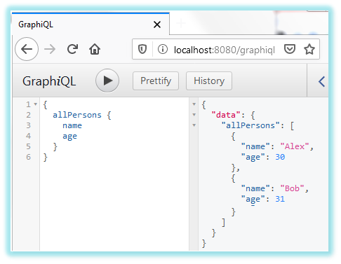

# Демонстрация на REST уеб услуга

[GraphQL](https://en.wikipedia.org/wiki/GraphQL) е език за дефиниране на API-та за извличане и манипулация на данни. Примерът използва:
- [Spring](https://en.wikipedia.org/wiki/Spring_Framework) за основа на сървърно приложение, 
- [H2](https://www.h2database.com/html/main.html) база данни за съхранение на данни в паметта на приложението, 
- [graphql-java-tools](https://mvnrepository.com/artifact/com.graphql-java/graphql-java-tools) за реализация на GraphQL услуга със Spring,
- [GraphiQL](https://github.com/graphql/graphiql) за тестването ѝ.

## Технологии
- Препочъва се използването на OpenJDK 8.

## Билд
```
mvnw clean package
```

---

## Стартиране

### GraphQL услуга (използваща Spring)
```
java -jar target/services-graphql-1.0-SNAPSHOT.jar
```
При стартиране приложението принтира `Running GraphQL web service...` (заедно с логовете от Spring) и започва да чака за клиентски заявки. 


### GraphQL клиент (използващ GraphiQL)
След стартиране на приложението, клиентът може да се достъпи на адрес http://localhost:8080/graphiql. 


#### Взимане на информация
Заявка връщаща само поле "name" на Person обектите:
```
{ 
  allPersons { 
    name 
  } 
}
```

Резултат:
```
{
  "data": {
    "allPersons": [
      {
        "name": "Alex"
      },
      {
        "name": "Bob"
      },
      {
        "name": "Claire"
      }
    ]
  }
}
```

Заявка ограничаваща броя резултати:
```
{ 
  allPersons(count: 2) { 
    name 
  } 
}
```

#### Създаване на запис
Заявка връщаща идентификатора на новосъздадения потребител:
mutation {
  createPerson(name: "Rob", age: 36) {
    id
  }
}
```

Резултат:
```
{
  "data": {
    "createPerson": {
      "id": "4"
    }
  }
}
```

#### Взимане на новия запис
Заявка:
```
{ 
  person(id: 1) { 
    name 
  } 
}
```

Резултат:
```
{
  "data": {
    "person": {
      "name": "Alex"
    }
  }
}
```

### Приключване
След приключване на демонстрацията спрете процеса на GraphQL услугата.

---
